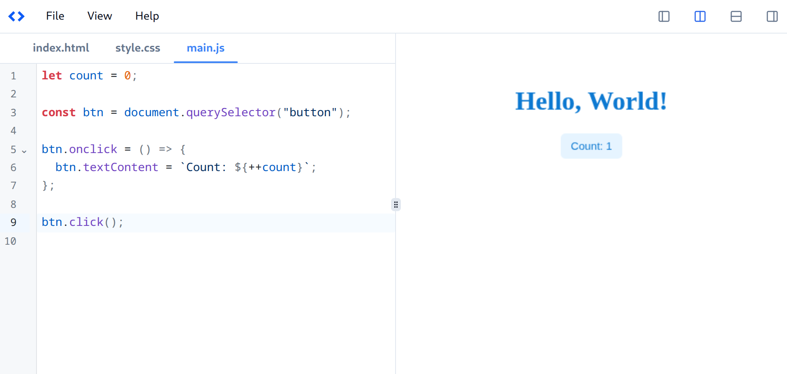

<div align="center">


<h1>LiveCode</h1>

A front-end code playground tool right in your browser. It's intended for use wherever possible most especially, live coding sessions for front-end developers.



</div>

## Features

- Easy to use
- Minimal and fast
- Live updates and preview
- Builtin IDE with syntax highlighting, suggestions, and more
- Local storage for backup (CTRL + S to save and automatic restore)

## Demo

Try this demo online: [Click Here](https://henryhale.github.io/livecode)

## Why?

I needed an offline tool to quickly learn and test front-end code (the basics). There are many code playgrounds online that offer much more but I intended to create a minimal, zero-config and easy to use playground.

If you need a more fully fledged online code playground, try;

- [StackBlitz](https://stackblitz.com)
- [CodeSandbox](https://codesandbox.io)
- [CodePen](https://codepen.io)

## Get Started

[](https://stackblitz.com/github/henryhale/livecode)

## Install

To setup `LiveCode` locally, follow the steps below;

- Clone this repository

```sh
git clone https://github.com/henryhale/livecode.git
```

- Install all dependencies

```sh
pnpm install
```

- Run dev server

```sh
pnpm dev
```

## Bugs, Issues and Contributions

I'm glad you took time to check `LiveCode`. Thank you very much.

All contributions are welcome, please follow the steps [here](https://github.com/henryhale/livecode/blob/main/.github/CONTRIBUTING.md)

For any bug or issue, kindly open one [here](https://github.com/henryhale/livecode/issues).

## Credits

Thanks to these amazing projects, `LiveCode` heavily depends on them;

- [vue.js](https://vuejs.org)
- [vite.js](https://vitejs.dev)
- [tailwindcss](https://tailwindcss.com)
- [codemirror](https://codemirror.net)
- [shadcn-vue](https://github.com/unovue/shadcn-vue)

## License

Released under [MIT License](./LICENSE.md)
